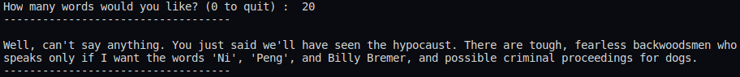

# Monty Python Markov Mactation

Markov Chains with Monty Python Dialogue given scraped movie/tv script data.

Usage: Run ``` python3 script.py ``` and input # of words to be generated

## Output Example:



Requirements:
- Python3
- Selenium
- BS4

## Data-Scraping Features:
- Movie/TV scripts are generously provided by http://montypython.50webs.com
- Cleaned text data is stored in text file and reused after initial scraping
## Text-Generation Features:
- First word of every sentence, *a* is chosen based on the probability that *a* often started sentences in the test data.
- Duplicates removed.
- Tracks probability that a certain punctuation mark comes after a word/phrase.
- Necessarily ends text generation on a punctuation mark.

### Thanks for checking out my project! 
