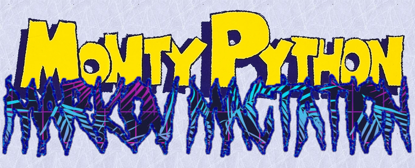

# Monty Python Markov Mactation

Markov Chains with Monty Python Dialogue given scraped movie/tv script data.

Usage:
```
	python3 script.py
```

Requirements:
- Python3
- Selenium
- BS4

## Text-Generation Features:
- ! Text data is stored in .txt file and reused after being scraped
- ! First word of every sentence, *a* is chosen based on the probability that *a* often started sentences in the test data.
- ! Duplicates removed.
- ! Tracks probability that a certain punctuation mark comes after a word/phrase.
- ! Necessarily ends text generation on a punctuation mark.

### Author's Note: Thanks for checking out my project! 
